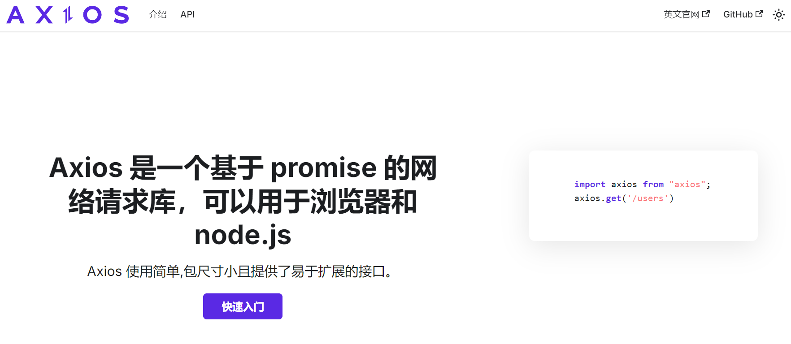

## axios相关网站

>Axios 是一个 **基于 Promise 的 HTTP 客户端库**，用于在浏览器和 Node.js 中发送网络请求。它支持 GET、POST 等常见请求方式，能够自动处理 JSON 数据，并提供请求与响应拦截器，便于统一处理鉴权、错误和数据格式。Axios 常用于前端与后端接口通信。

### **📕  [Axios官方 中文文档](https://www.axios-http.cn/)**

