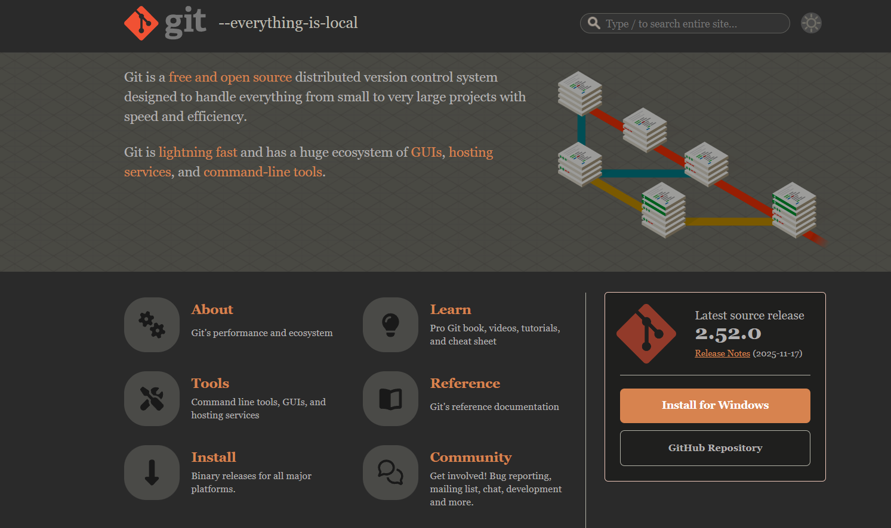
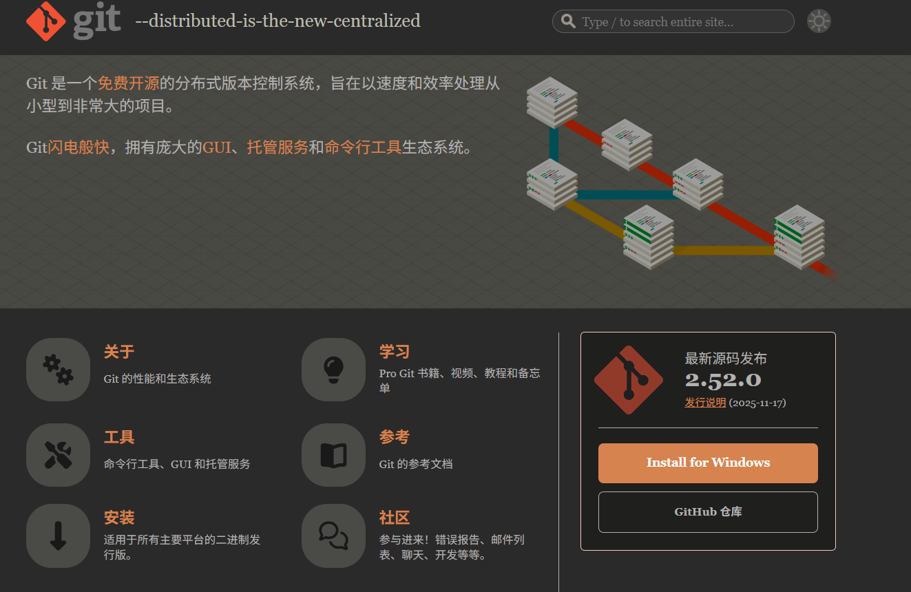
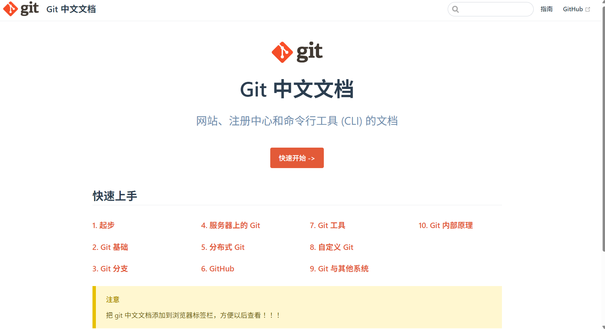

## git相关网站

>Git 是一种 **分布式版本控制系统**，用于管理和追踪代码的变化。它支持多人协作开发，能够记录每一次修改历史，方便回退和分支管理。Git 具有速度快、可靠性高的特点，广泛应用于软件开发中，常与 GitHub、GitLab 等代码托管平台配合使用。

### **🏷️  [git官网](https://git-scm.com/)**

Git 是一个免费且开源的 分布式版本控制系统设计用于处理从小型到 非常大型且高效且快速的项目。

Git 速度极快 ，拥有庞大的生态系统 图形界面 ， 托管服务 ，以及 命令行工具 。

### **🏷️ [git 中文文档](https://git-scm.cn/)**

### **🏷️ [git-中文文档](https://www.gitrc.cn/)**

