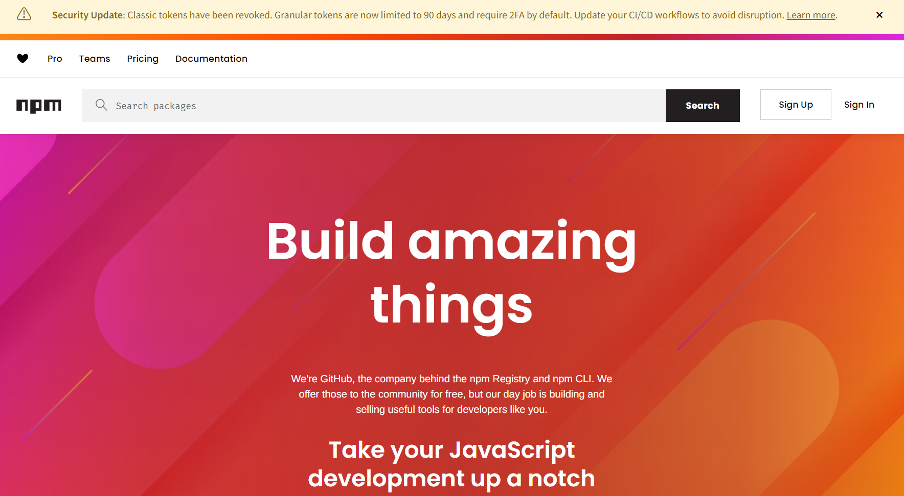
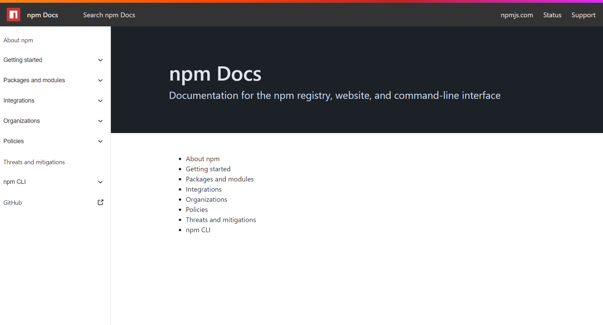
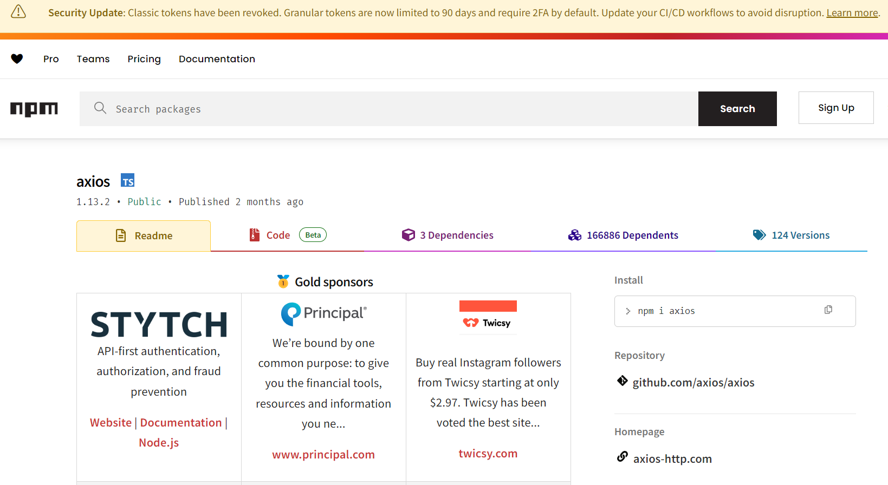

# npm相关网站

>npm（Node Package Manager）是 **Node.js 的官方包管理工具**，用于管理 JavaScript 项目的依赖。它可以从 npm 官方仓库下载、安装、更新和卸载第三方库，并通过 `package.json` 统一管理项目依赖和脚本。安装 Node.js 时会自动安装 npm，是前端和 Node.js 开发中最基础、最常用的工具之一。

### **🦖 [npm官网](https://www.npmjs.com/)**

### **📚 [npm 官方文档](https://docs.npmjs.com/)**

### **🏃‍♀️ [axios - npm](https://www.npmjs.com/package/axios)**

