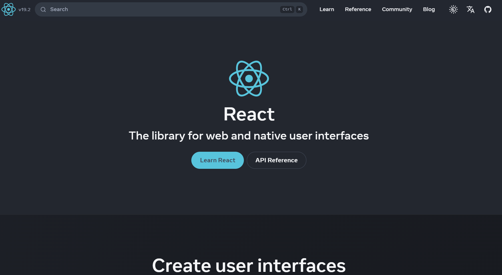
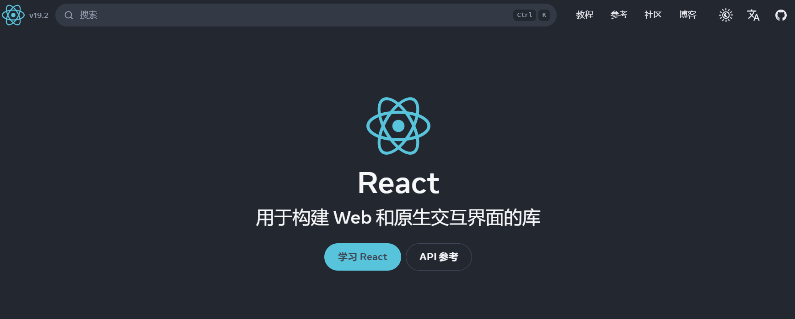

## react相关网站

>React 是一个 **用于构建用户界面的 JavaScript 库**，由 Facebook 推出，主要用于开发 Web 前端应用。它采用组件化思想和声明式编程，通过虚拟 DOM 提升页面渲染效率。React 常与 React Router、Redux 等库配合使用，适合构建复杂、交互性强的单页应用。

### **🌟  [React 官网](https://react.dev/)**

### **📖 [React 官方中文文档](https://zh-hans.react.dev/)**

