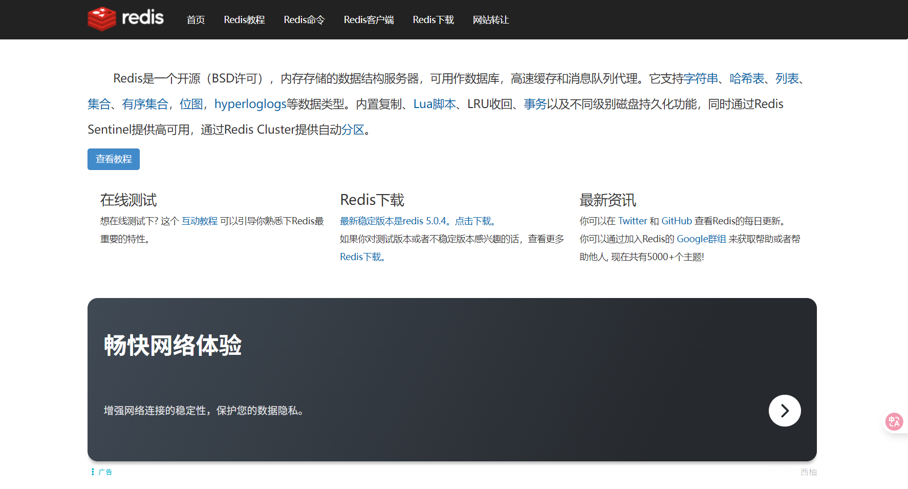
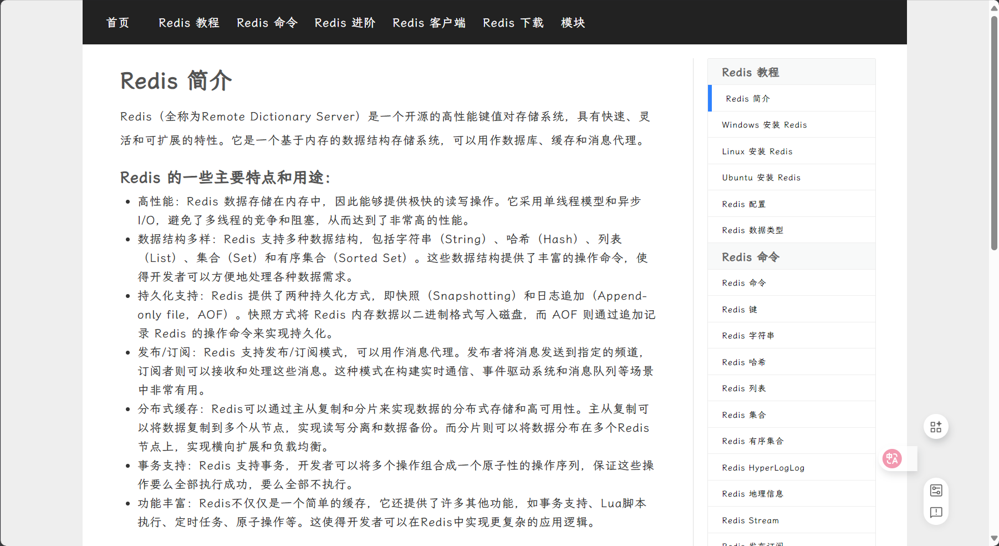
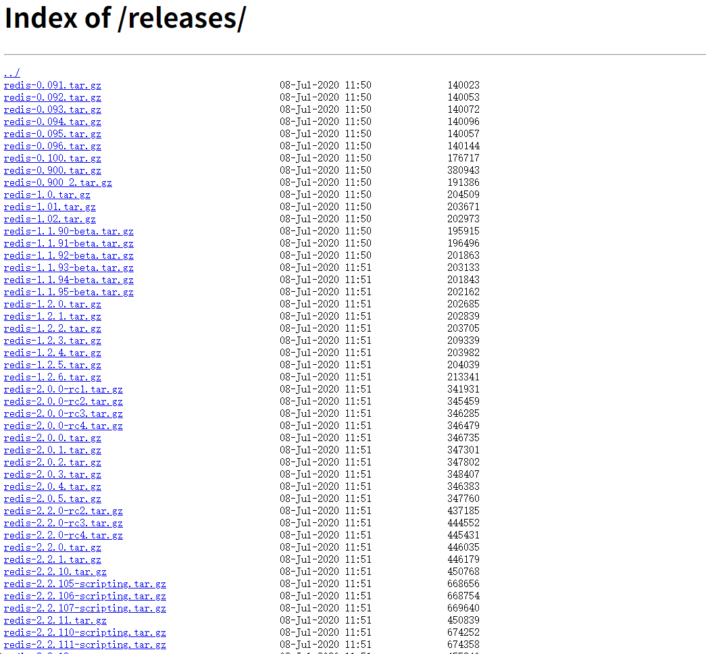
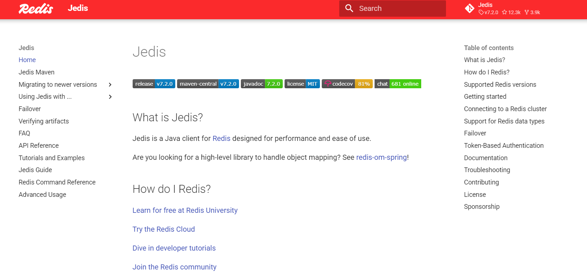
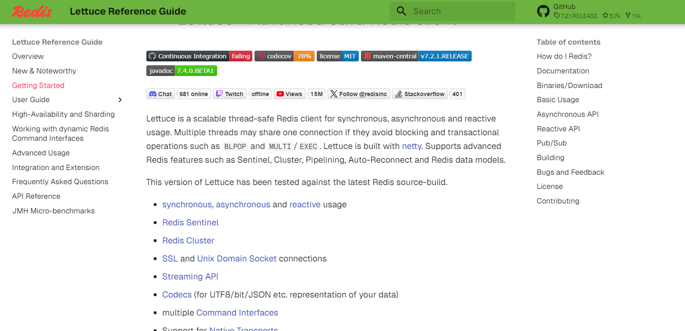

## redis相关技术

>Redis（Remote Dictionary Server）是一个 **基于内存的高性能键值型数据库**，常用于缓存、会话存储和高并发场景。它支持多种数据结构，如字符串、哈希、列表、集合和有序集合，读写速度非常快。Redis 也支持持久化、发布订阅、事务和简单的分布式功能，常作为关系型数据库的补充，用来提升系统性能和并发能力。

### **💾 [redis官网](https://redis.io/)**

官网对新手来说不是那么易懂。

### **🕺 [Redis中文网](https://www.redis.net.cn/)**

这个网站非常适合快速入门的人员，教程简单易懂，把主要的内容列出来了，但是缺点是广告有点多。

### **🥙 [Redis 中文网](https://redis.com.cn/redis-intro.html)**

这个网站和前面的一样简单易懂，也是中文。但是它没有那么多广告。

### **💼 [redis的安装包大全](https://download.redis.io/releases/)**

这个网站可以很方便的使我们下载redis，里面有liunx的和windows的安装包。

### **🥳 [Jedis -供java使用的客户端redis](https://redis.github.io/jedis/)**

### **🤩 [Lettuce-供java使用的客户端redis](https://redis.github.io/lettuce/)**

