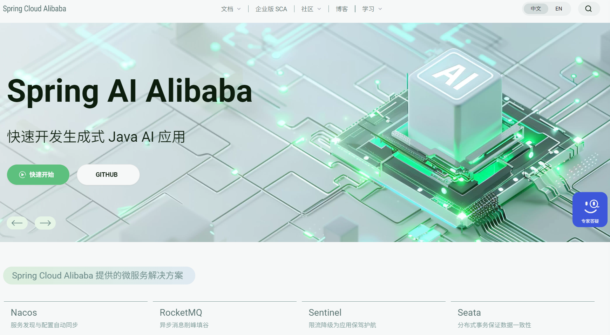
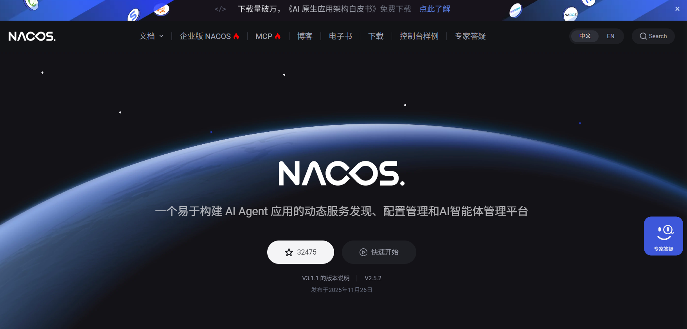
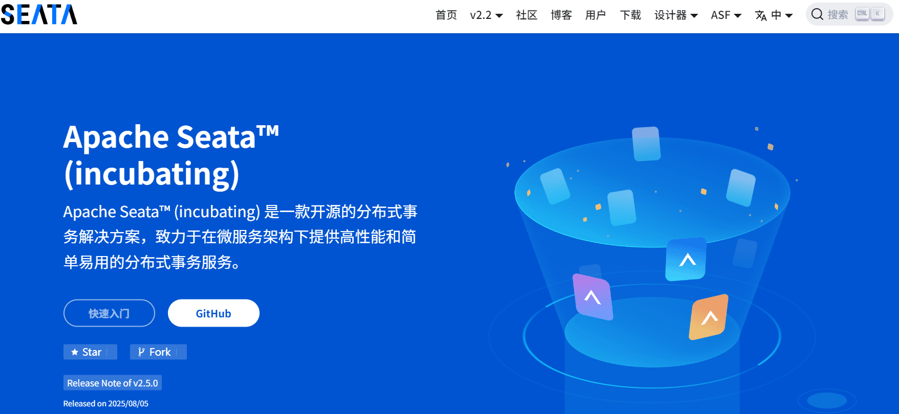
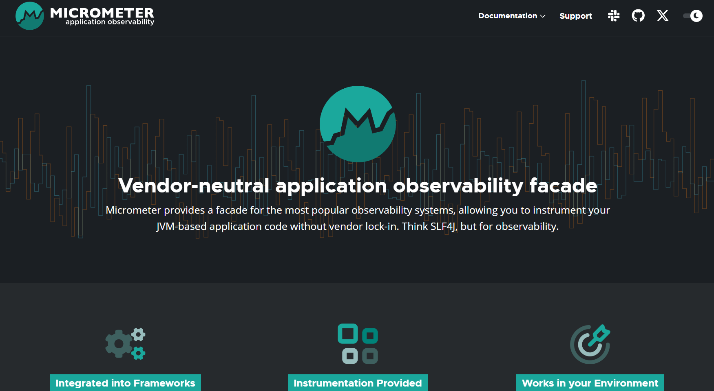

## spring cloud相关网站

>Spring Cloud 是 **基于 Spring Boot 的微服务开发框架体系**，用于构建分布式系统。它提供了服务注册与发现、配置管理、负载均衡、服务调用、熔断限流等一整套解决方案，帮助开发者快速搭建和管理微服务架构，常用于中大型后端系统。

### **🍃  [Spring Cloud 官网文档](https://spring.io/projects/spring-cloud)**

### **🐼 [Spring Cloud Alibaba官网](https://sca.aliyun.com/)**

Spring Cloud Alibaba 是 **阿里巴巴基于 Spring Cloud 生态提供的一套微服务解决方案**。它整合了 Nacos、Sentinel、Seata、RocketMQ 等组件，提供服务注册与配置管理、流量控制、分布式事务和消息通信等能力，适合构建高可用、高并发的微服务系统。

### **🪖 [sentinel 官网](https://sentinelguard.io/zh-cn/)**

随着微服务的流行，服务和服务之间的稳定性变得越来越重要。Sentinel 是面向分布式、多语言异构化服务架构的流量治理组件，主要以流量为切入点，从流量路由、流量控制、流量整形、熔断降级、系统自适应过载保护、热点流量防护等多个维度来帮助开发者保障微服务的稳定性。

### **⚙️ [Nacos官网| Nacos 配置中心](https://nacos.io/)**

Nacos `/nɑ:kəʊs/` 是 `Dynamic Naming and Configuration Service` 的首字母简称，一个易于构建 AI Agent 应用的动态服务发现、配置管理和AI智能体管理平台。

### **🎛️ [Apache Seata-分布式事务](https://seata.apache.org/zh-cn/)**

Seata 是一款开源的分布式事务解决方案，致力于提供高性能和简单易用的分布式事务服务。Seata 将为用户提供了 AT、TCC、SAGA 和 XA 事务模式，为用户打造一站式的分布式解决方案。

### **⛓️ [Micrometer -服务链路追踪](https://micrometer.io/)**

