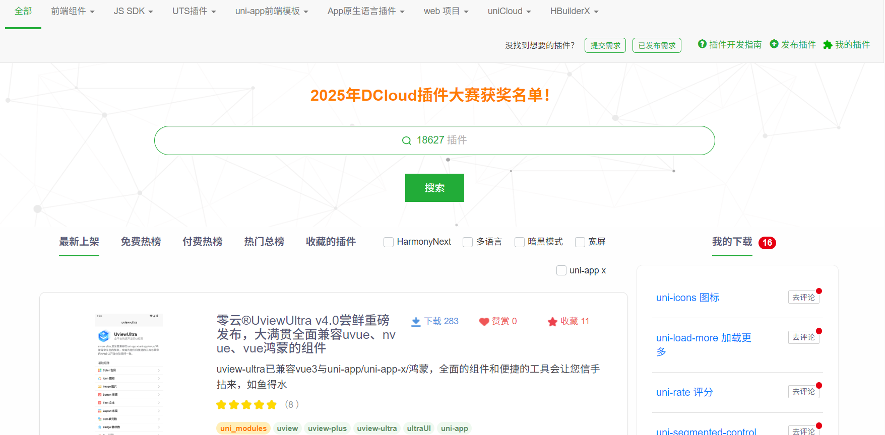
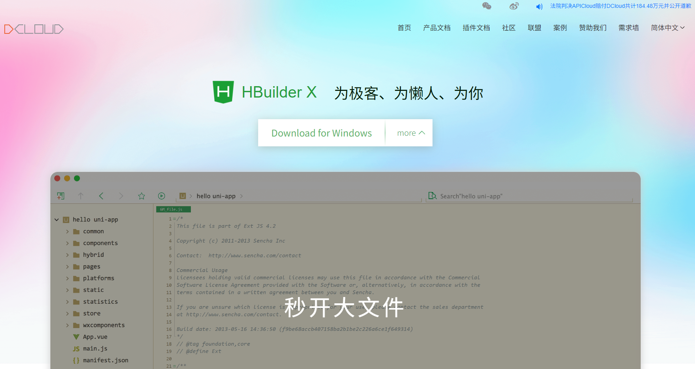

## uniapp相关网站

>uni-app 是一个 **基于 Vue 的跨平台应用开发框架**，由 DCloud 推出。它采用“一套代码，多端运行”的模式，可同时编译到微信小程序、H5、App 等多个平台。uni-app 使用 Vue 语法进行开发，提供统一的 API 和组件体系，适合快速开发多端应用。

### **🐉 [uni-app官网文档](https://uniapp.dcloud.net.cn/)**

### **🔌  [DCloud 插件市场](https://ext.dcloud.net.cn/)**

### **🔧  [开发工具-HBuilderX](https://www.dcloud.io/hbuilderx.html)**

