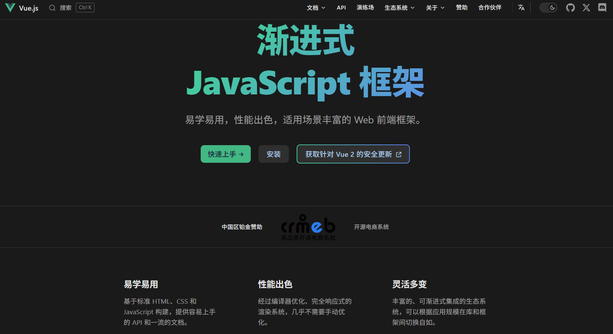
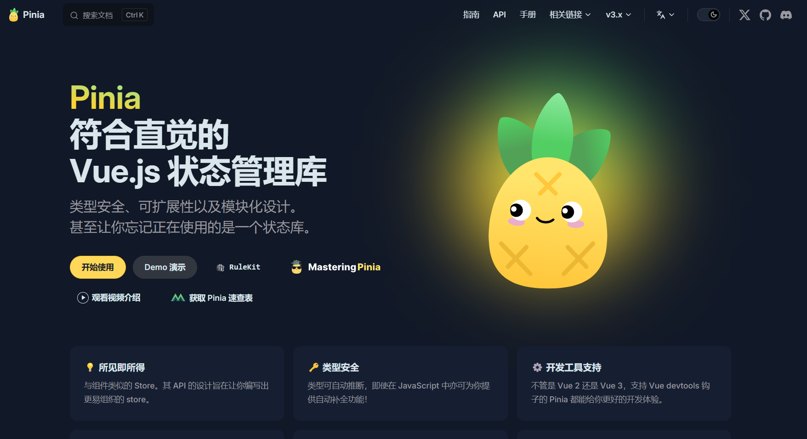
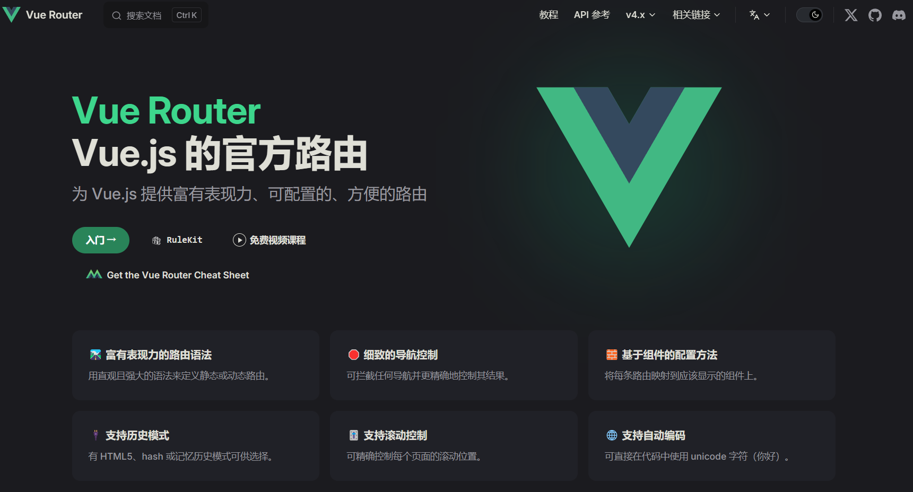
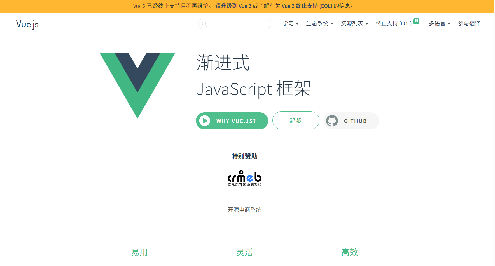

## vue相关官方网站

>Vue 是一个 **用于构建用户界面的渐进式 JavaScript 框架**，主要用于开发 Web 前端应用。它采用组件化开发方式，支持数据驱动视图和双向绑定，语法简洁、上手快。Vue 常与 Vite、Vue Router、Pinia 等工具配合使用，适合构建单页应用（SPA）和中大型前端项目。

### **🖼️ [Vue.js 官网](https://cn.vuejs.org/)**

### **🍍[Pinia-状态管理库 官网](https://pinia.vuejs.org/zh/)**

Pinia 是 **Vue 官方推荐的状态管理库**，用于集中管理应用中的共享状态，适配 Vue 3。它基于组合式 API 设计，语法简洁，支持模块化、类型推断和热更新。Pinia 常与 Vue 组件配合使用，用来管理用户信息、全局配置等跨组件数据，是 Vuex 的替代方案。

### **🗺️ [Vue Router-官网](https://router.vuejs.org/zh/)**

Vue Router 是 **Vue 官方的前端路由管理库**，用于在单页应用（SPA）中实现页面导航与组件切换。它通过 URL 与组件的映射关系，控制不同路径下显示的视图内容，支持动态路由、嵌套路由和路由守卫。Vue Router 常与 Vue 结合使用，用来构建具有多页面体验的前端应用。

### **👔 [Vue2 官网](https://v2.cn.vuejs.org/)**

